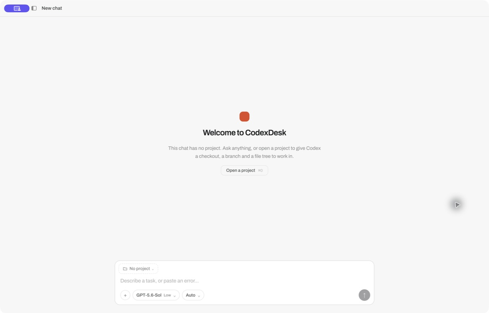

# CodexDesk

An independent desktop client for the Codex app-server interface. It keeps
projects, conversations, files, terminals, approvals, and Codex capabilities
in one local Electron workspace.



> [!IMPORTANT]
> CodexDesk currently ships for Apple-silicon macOS.

## Highlights

- Organize Codex conversations by project, with pinning, archiving, search,
  multiple windows, and a global quick-chat shortcut.
- Start work locally or in an isolated Git worktree, optionally from a chosen
  branch.
- Follow streaming Markdown, tool activity, plans, approval requests, and
  attached images in a native desktop conversation view.
- Browse workspace files, open file references, and keep terminals attached to
  their conversations.
- Inspect and configure skills, plugins, MCP servers, and web-search behavior
  exposed by Codex.
- Keep privileged operations in Electron's main process behind a narrow preload
  API; the renderer has no direct Node.js access.

## Install

Download the Apple-silicon `.dmg` from the
[GitHub Releases page](https://github.com/QIU-Shuo/codexdesk/releases), open it,
and drag CodexDesk into Applications. Each release is signed with an Apple
Developer ID and notarized by Apple. The accompanying ZIP is used by the
in-app updater; most people should install with the DMG.

CodexDesk requires:

- An Apple-silicon Mac (`arm64`). Windows, Linux, and Intel Mac builds are not
  yet part of the release matrix.
- A Codex account. CodexDesk guides you through sign-in after setup.

On first launch, CodexDesk offers to download its pinned Codex 0.144.4 runtime
directly from `releases.openai.com` (about 111 MB). It verifies the published
SHA-256 checksum, package metadata, exact version, and OpenAI Developer ID
signature before installing the runtime under CodexDesk's application-data
directory.

The app does not bundle Codex, search your `PATH`, change shell profiles, or
replace another Codex installation. It launches the verified app-private
runtime by absolute path and communicates with `codex app-server` over local
stdio JSON-RPC. CodexDesk and other Codex clients may still share the normal
`~/.codex` account, configuration, plugin, and conversation data.

See [Privacy](PRIVACY.md), [Support](SUPPORT.md), and the
[Security policy](SECURITY.md) before using CodexDesk with sensitive source
code.

## Run from source

Source development additionally requires Node.js 22.12 or newer, npm, and Git.

```sh
git clone https://github.com/QIU-Shuo/codexdesk.git
cd codexdesk/app
npm install
npm start
```

The first launch installs the managed runtime, asks you to sign in if needed,
and then asks you to choose a project folder.

## Development

The application lives in `app/` and uses Electron Forge, Vite, React, and
TypeScript.

```sh
cd app
npm run verify   # architecture checks, typechecks, and unit tests
npm run package  # build an unpacked application bundle
npm run make     # create the configured distributable
```

Changes in the first release are summarized in the
[CodexDesk 0.1.0 release notes](RELEASE_NOTES.md).

The committed protocol bindings were generated with Codex CLI 0.144.4. When
updating the app-server protocol, use the matching CLI and update the pinned
artifact metadata in `app/src/main/managedCodex.ts` plus the protocol version
constants in `app/src/main/preflight.ts` in the same change:

```sh
cd app
npm run protocol:generate
```

## Security and trust model

CodexDesk is a local client, but it is not a sandbox by itself:

- Codex tools and the integrated terminal can execute commands on your machine.
  Review approval requests and use an appropriate Codex permission profile.
- Git worktrees reduce interference between tasks; they are not a security
  boundary.
- Authentication is owned by Codex. CodexDesk does not persist an OpenAI API
  key; API-key sign-in is handed directly to the local managed runtime.
- Filesystem and process access stay in Electron's main process. The renderer
  uses context isolation, no Node integration, a restrictive Content Security
  Policy, and explicit IPC operations.
- Project file reads are confined to registered workspace and worktree roots;
  attachment image reads use a separate narrow allow-list.

Please report suspected vulnerabilities privately to the maintainer instead of
opening a public exploit report.

## Project status

CodexDesk has a permanent macOS bundle identifier, Developer ID signing and
notarization, and a maintainer-controlled release workflow. The initial release
target is macOS arm64 and ships as a DMG, with a ZIP retained for automatic
updates. Source builds and packaged development builds are also supported.

## Independence from OpenAI

CodexDesk is not affiliated with, endorsed by, or sponsored by OpenAI.
Codex and OpenAI are trademarks of their respective owner. References to them
describe compatibility with the public Codex app-server interface.

## License

Original CodexDesk code is licensed under the [MIT License](LICENSE).
Generated TypeScript protocol definitions under `app/src/protocol/generated/`
remain under Apache License 2.0; see [NOTICE](NOTICE) and
[THIRD_PARTY_LICENSES/Apache-2.0.txt](THIRD_PARTY_LICENSES/Apache-2.0.txt).
React Symbols file and folder icons remain under the MIT License; see
[THIRD_PARTY_LICENSES/React-Symbols-MIT.txt](THIRD_PARTY_LICENSES/React-Symbols-MIT.txt).
Complete production npm dependency notices are generated at
[THIRD_PARTY_LICENSES/npm-production-notices.txt](THIRD_PARTY_LICENSES/npm-production-notices.txt),
and packaged Electron builds include Chromium's full notices.
